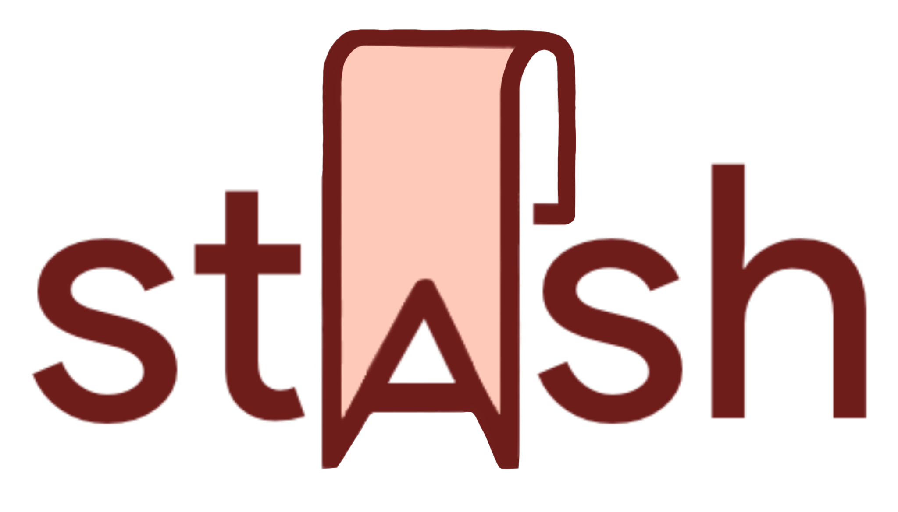

## Table of Contents
[ABOUT](#stash-application) 
[DEMO](#demo) 
[CONTEXT](#context) 
[MOTIVATION](#motivation) 
[TECHNOLOGIES](#technologies) 
[FEATURES](#features) 
[FILES AND FOLDERS](#files-and-folders) 
[FUTURE IMPROVEMENTS](#future-improvements) 

## Stash Application
Stash is a multiplatform mobile application that facilitates social interactions between friends online. Stash centralizes the recommendations for songs, movies, books, YouTube videos and other media your friends send you into one convenient dashboard, so you never lose track of what they share with you again. You can create groups to share recommendations with, sort the recommendations you’ve received by sender or by media type, and react to what was sent to you, all on the same platform. 

Created by **Alice Huang**, **Jacquelyn Chow**, **Leia Rich**, and **Lamia Makkar**
#### [Click here to check out the app](sitelinkhere.com)
#### [Click here to check out the preliminary Figma Design](https://www.figma.com/file/bF4SxsXaXwPBtepDlyMyfh/Stash-App?node-id=0%3A1)

* Beta version is currently compatible with iPhone and Android phones. 

## Demo

## Context
Social interactions in this digital age rely heavily on sending and receiving multimedia content from friends, including links to articles, music videos, TikToks and more, as well as recommendations for songs, movies, books and podcasts to check out. These recommendations form the foundation of our conversations and relationships with others. People like to connect over shared interests or new ideas they have come across.
  
Still, few follow through on the recommendations they receive, such as a video to watch or a song to listen to. This is largely the result of how much technology we consume and the number of different apps and websites competing for our attention as well as the fact that these recommendations come from multiple people across multiple social media and texting platforms. It is hard to keep track of recommendations from these different sources or even remember something someone recommended during a conversation when messages get lost in a stream of later texts. For example, by the time someone wants to watch a movie, it is often difficult to find their friends’ movie recommendations and end up wasting time searching for what to watch online. Similarly, when people are too busy to check out a recommendation, like a video link, straight away, it is also easy to accidentally leave your friend on ‘read’ because you never got to their recommendation. For these reasons, people rarely end up circling back to a friend with their reaction to whatever they shared. 
  
This problem has become increasingly relevant during the pandemic, as people are forced to stay indoors and connect virtually. Sharing good movies or songs has become a major way to socialize and keep up with others. Many people are also spending more time watching movies and reading books, which means more people are looking for recommendations too. To help lessen the enormous stress most people are facing, it is important to facilitate the way people connect with one another.

## Motivation
Stash is an effective solution because people typically make recommendations using a variety of social media or texting platforms on their smartphones already, so users would not have to spend a lot of extra effort to change their recommendation habits. Stash also maintains and enhances the critical social aspect of connecting with friends over recommendations by allowing users to create groups and react to recommendations. If people can refer to one app when looking for recommendations or a way to share something they found, they are more likely to actually continue the conversation with others about their shared recommendations. 

## Technologies
* **Version Control**: Git through GitHub
* **Programming Language**: ReactNative
* **Development Environment**: Virtual Studio Code
* **Platforms**: Stash will be a multiplatform mobile app available for iOS and Android.
* **Software APIs**: Expo framework for developing ReactNative apps, Firebase Phone Number authentication, various React Native & Expo modules
* **Database**: Cloud Firestore (Firebase)
* **Project Tools**: Team collaboration and communication: Slack
* **Project Management**: Trello board (organize to-dos, in-progress, delegate tasks)
* **UI/UX Designing and Planning**: Figma

## Features
#### **Splash Screen**
* Splash screen while app is waiting to open with Stash logo and "from CS71 Group #2"
#### **Login and Onboarding Screen**
* User can login or sign up for Stash when first opening the app
  * Verify login and signup using phone authentication with an SMS code and reCAPTCHA system
* Swipe or click on tabs for various onboarding instructions
* User will stay logged in even after exiting the app
  * Upon opening app, loading screen redirects user to appropriate page based on logged in status
* Error checking
  * Check if username is already taken
  * Check for empty fields, length and format of fields
#### **Homepage with 2 Views**
* Stash logo on the top left corner
* Logout option at the top right corner
* Toggle tabs at the top between 2 views (By Pod or By Media Type)
* Displays groups or media types with tiles
#### **Recommendations Feed (By Pod)**
* Create a Pod pop up with essential information for making a group (name, search for members, etc)
* Option to leave pod (last member in the pod will be able to delete pod instead of leave pod)
* Option to change pod's name
* Displays pods on refresh (pull down screen) and upon the creation of a new pod
  * Pod name, number of members, number of recs shown on pod tile
* Create A Pod button on the bottom right corner
  * Users can choose a pod name, pod image, and search for users to add to a pod
  * Users can only add a user to a pod once (re-clicking on a user will remove them from the pod)
  * Once an image is chosen, loading screen pops up as image is uploaded to server and its image URL is fetched
    * Images are resized before uploaded to server to preserve space in Firebase Firestore
  * Error checking: user must choose at least one user to add to their new pod
#### **Pod Page**
* Back symbol on top left corner, pod name in the center, pod image on top right corner 
* Displays all recs for that specific pod with the Rec name, Media Type, Media Type icon
* Users can click on the circle if that rec was seen or not (upon refresh or upon click)
* Show group members button on the bottom right will list all members in that pod 
* Add/Send a Rec button on the bottom right allows users to create recommendations for that specific pod
  * Based on the media type selected (Article, Book, Movie, Song, TikTok, or YouTube), users will be able to fill in different fields based on the selected media type
  * Error checking: user must select a media type and provide at least a name for all recommendation types and a link for video types (YouTube & TikTok), all other fields are optional. Links inputted for both video types (YouTube & TikTok) and the song types will also be checked for validity before it can be added to a recommendation.  
* Click on a Rec for more information about that Rec
  * Displays Full Rec name, media type, other media type specific details, comments (if provided), who the rec was recommended by, and in what pod this rec was recommended in
  * Links included in the rec are clickable and navigates to the article, song,
  or video that is linked
* Option to delete a Rec 
#### **Recommendations Feed (By Type)**
* Shows recs that user has by selected type (Article, Book, Movie, Song, TikTok, or YouTube)
  * Color coded tile icons and titles according to selected type
  * Displays how many recs per media type and from how many people (or person)
#### **MediaType Page**
* Displays all the user's recs for that specific media type
* This feed will have all of the same rec functionalities as **Pod Page**, except for the ability to add a recommendation; recs must be added within pods

## Files and Folders
### **Test**
#### **Test**

## Future Improvements
* Once the user marks a recommendations as watched/read/listened to, removing that recommendation from their main feeds. In this case, the user would be able to visit ‘Past Recommendations’ in order to see what they have already visited. 
* Allowing the user to react to the recommendations they receive in the recommendations’ pop-up screen.
* Allowing the user to search through the recommendations in each group or each media category.
* Dividing recommendations in groups between those received and those sent.
* Visually display the thumbnail of linked media types (ex. YouTube videos, TikTok videos) within the recommendation bubble.
* Allowing users to personalize their profile with a profile picture and allow members to change pod pictures after the pod is already created. 
* Allowing users to accept / decline being added to a pod.
* Allowing users to send invites to other contacts and send an SMS to that number.
* Offering more media type categories like Recipes, Netflix shows, Restaurants, and more.
* Making the app compatible as a web-based app.
* Potentially publishing our app to the App Store.
